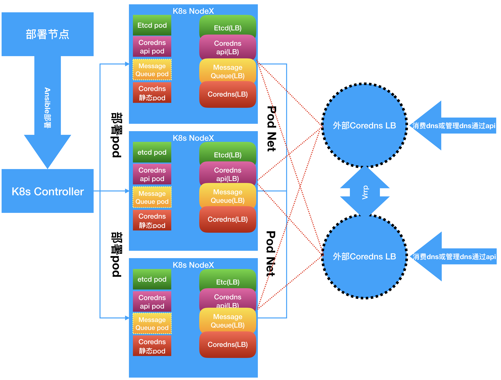
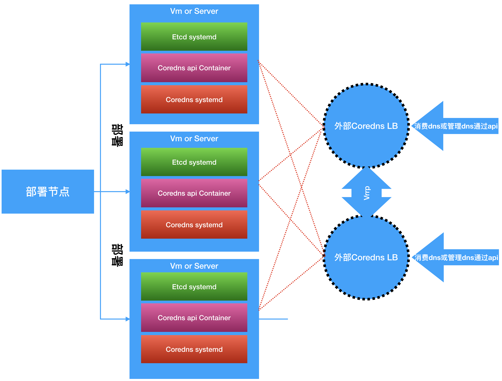

# coredns-deployment

- 主要用于在边缘方案中部署整套coredns的产品。
- 部署中分为二种部署方式: `基于k8s的部署`和`不基于k8s的部署`
- 我们在生成中推荐使用的部署方式是: `基于k8s的部署`
- 我们在文档中会阐明如果一些`离线部署`的时候，必须由`部署人员`预先准备好的，我们会给出一些建议
- 请注意`(offline)`的字样的步骤，只有在offline的情况下才需要去做，有网络的情况下可以忽略

## 在k8s解决方案的部署(推荐)

1. 在非k8s集群里部署`coredns`、`coredns-speaker(api)`、`消息队列nats(可选)`、`etcd数据库集群`

## 软件架构



1. 图中Message Queue Pod的部署是可选的，我们在后面的文档中将提及
2. 图中`外部Coredns LB`是要另外部署的不在部署脚本中，因为我们并不知道底层的运行环境到底是什么，如果是OpenStack可以用Lbaas，再或者可以自行搭建nginx+keepalive来做负载均衡和Failover

## 部署时的架构

1. 选项1-(offline)单独的部署节点

    ```console
                          |---复制软件包---> [部署节点(ansible)] ----ansible部署----> [k8s/caas(openshift)master节点]
    # [本机(准备离线软件包)] |                                                                    ^^
                          |--------------------------------复制镜像------------------------------|
    ```

2. 选项2-(offline)本机作为部署节点

    ```console
    # [本机(准备离线软件包)] ---1.复制软件包/2.复制镜像/3.ansible部署----> [k8s/caas(openshift)master节点]
    ```

3. 选项3-单独的部署节点

    ```console
    # [部署节点] ---ansible部署----> [k8s/caas(openshift)master节点]
    ```

4. 选项4-本机作为部署节点

    ```console
    # [本机] ---ansible部署----> [k8s/caas(openshift)master节点]
    ```

## （offline，非offline可以跳过）准备必要的工具

1. `k8s/caas(openshift)master节点`配置正确的k8s/caas(openshift)集群，通常是预先安装好的
2. 在你`本机`下载以下镜像并打包为tar文件

    ```console
    # 以下镜像需要你在有网络的情况下预先准备，然后将打包的tar文件带到离线环境被上传部署
    $ docker pull 99cloud/coredns-management-api:latest
    $ docker save 99cloud/coredns-management-api:latest -o coredns-mgrt.tar
    $ docker pull 99cloud/coredns-edge:latest
    $ docker save 99cloud/coredns-edge:latest -o coredns-edge.tar
    $ docker pull quay.io/coreos/etcd:v3.2.13
    $ docker save quay.io/coreos/etcd:v3.2.13 -o etcd.tar
    $ docker pull quay.io/coreos/etcd-operator:v0.9.4
    $ docker save quay.io/coreos/etcd-operator:v0.9.4 -o etcd-operator.tar
    # (message queue)可选当coredns-deployment/inventory_k8s.example文件中的参数coredns_speaker_mode="passive"的话下面的镜像不需要准备
    $ docker pull connecteverything/nats-operator:0.6.0
    $ docker save connecteverything/nats-operator:0.6.0 -o nats-operator.tar
    $ docker pull nats:1.3.0
    $ docker save nats:1.3.0 -o nats.tar
    ```

3. 在你`本机`准备项目文件

    ```console
    # 目前项目是public的,如果到时候变成了private的了，没有权限可以向容器开发组的小伙伴提出
    $ git clone http://gitlab.sh.99cloud.net/mep/mep-deployment.git
    # 在ansible项目下创建二进制文件目录
    # mkdir [path]/mep-deployment/coredns-deployment/roles/prepareation/binary
    $ curl -s -L -o [path]/mep-deployment/coredns-deployment/roles/prepareation/binary/cfssl https://pkg.cfssl.org/R1.2/cfssl_linux-amd64
    $ curl -s -L -o [path]/mep-deployment/coredns-deployment/roles/prepareation/binary/cfssljson https://pkg.cfssl.org/R1.2/cfssljson_linux-amd64
    $ chmod +x [path]/mep-deployment/coredns-deployment/roles/prepareation/binary/{cfssl,cfssljson}
    ```

4. `部署节点`需要自行预先安装以下软件，如果必要的话可以自己预先准备安装包或者是`虚拟机的镜像`（当然部署节点可以是你的本机，只要网络通即可）
    - ansible
    - curl

5. 在你`本机`准备`cfssl和cfssljson`二进制包

    ```console
    $ curl -s -L -o [path]/cfssl https://pkg.cfssl.org/R1.2/cfssl_linux-amd64
    $ curl -s -L -o [path]/cfssljson https://pkg.cfssl.org/R1.2/cfssljson_linux-amd64
    ```

### 准备工作-部署节点

1. 将部署节点的上的公钥复制到`k8s/caas(openshift)master节点`,在`部署节点`上运行

    ```console
    $ ssh-keygen # 创建密钥对，一路按回车确认
    $ ssh-copy-id root@[k8s/caas(openshift)master节点的ip或域名] # 复制公钥到k8s/caas(openshift)master节点
    # 尝试链接
    $ ssh [k8s/caas(openshift)master节点的ip或域名] # 不需要密码
    ```

2. (offline)从`本机`复制之前准备的`cfssl和cfssljson`二进制包到 `/usr/bin/`下

    ```console
    $ scp [path]/cfssl [root]@[部署节点]:/usr/bin/
    $ scp [path]/cfssljson [root]@[部署节点]:/usr/bin/
    $ ssh [root]@[部署节点] chmod +x /usr/bin/{cfssl,cfssljson}
    ```

3. 在`部署节点上`准备repo
    - 选项1-(offline)从`本机`将预先下载好的Repo复制到`部署节点`上

        ```console
        $ scp -r [path]/mep-deployment/coredns-deployment/ [user]@[部署节点ip或域名]:/root/
        ```

    - 选项2-在`部署节点上`下载repo,或者使用预先下载好的repo

        ```console
        $ yum install git,ansible -y
        $ git clone http://gitlab.sh.99cloud.net/mep/mep-deployment.git
        ```

### 准备工作-k8s/caas(openshift)master节点,即`inventory_k8s.example`下的[master1]下对应的节点

1. (可选)如果是在openshift平台上运行请使用命令`oc edit scc restricted`，并修改 `runAsUser: RunAsAny`和`fsGroup: RunAsAny`
2. 请确保`k8s/caas(openshift)master节点`上的kubectl或者oc命令行工具已经正确配置为管理身份,通常k8s的情况下不需要做任何修改，
    - (可选)当你使用caas(openshift)的情况下，运行命令:

    ```console
    # 修改`[path]/mep-deployment/coredns-deployment/roles/etcd-operator/templates/etcd-cluster.yml.j2`
    $ oc login -u system:admin
    ```

3. 准备k8s/caas(openshift)的块存储，在k8s搭建完成后没有持久化的存储配置，需要我们手动的去配置，`当使用caas(openshift)的话一般都会默认接好一种存储的storage class`比如cinder、ceph、glusterfs等等
    - 选项1-k8s配置storage class请查看[配置storage class](https://kubernetes.io/docs/concepts/storage/storage-classes/)
    - 选项2（推荐）-根据具体的k8s的部署项目的文档来操作
    - 选项3 (测试环境非生产)-使用主机的磁盘

        ```console
        # 在inventory_k8s.example文件中[master1]下面的机器上运行命令
        # 把原本的从persistentVolumeClaimSpec开始一直到最后的行前面添加"#"注释，这样etcd在部署的时候会使用主机磁盘
        # 此方法只供测试使用不能上生产切记
        persistentVolumeClaimSpec:
          storageClassName: {{ etcd_storage_class_name }}
          accessModes:
          - ReadWriteOnce
          resources:
           requests:
              storage: {{ etcd_storage_size }}Gi
        ```

4. (offline)复制镜像到部署节点上然后你有以下1个选项:
    - 选项1-手动加载镜像到每一个k8s/caas(openshift)的工作节

        ```console
        # 从本机复制镜像到所有的k8s/caas(openshift)的工作节
        # 记得要循环拷贝到每一个节点上，因为k8s/caas(openshift)会调度这些pod到任何工作节点上如果不做特别限制的情况下
        $ scp `.tar [user]@node:/root/
        $ ssh [user]@[k8s/caas(openshift)的工作节ip或者域名] docker load -i /root/coredns-mgrt.tar
        $ ssh [user]@[k8s/caas(openshift)的工作节ip或者域名] docker load -i /root/coredns-edge.tar
        $ ssh [user]@[k8s/caas(openshift)的工作节ip或者域名] docker load -i /root/etcd.tar
        $ ssh [user]@[k8s/caas(openshift)的工作节ip或者域名] docker load -i /root/etcd-operator.tar
        # (可选)当coredns-deployment/inventory_k8s.example文件中的参数coredns_speaker_mode="passive"的话下面的镜像不需要准备
        $ ssh [user]@[k8s/caas(openshift)的工作节ip或者域名] docker load -i /root/nats-operator.tar
        $ ssh [user]@[k8s/caas(openshift)的工作节ip或者域名] docker load -i /root/nats.tar
        ```

### 开始部署

1. 在`部署节点上`进入项目目录`mep-deployment/coredns-deployment`
2. (offline)修改 `[path]/mep-deployment/coredns-deployment/inventory_k8s.example`文件中参数`offline="yes"`
3. 修改 `[path]/mep-deployment/coredns-deployment/inventory_k8s.example`文件中那些不符合你需求的配置

    ```console
    [all:vars]
    # <basic section starts>
    oc_binary="/usr/bin/kubectl" # 默认不用改
    namespace_coredns_edge="coredns-edge" # 默认不用改
    caas_cluster_domain="cluster.local" # 默认不用改
    # 当选择passive模式的话，将跳过nats消息队列的部署
    coredns_speaker_mode="passive" # 使用passive就ok了
    offline="no" # 如果是离线安装请设置为offline="yes"
    # </basic section ends>

    # <tls sign section starts>
    # 证书签名按需修改， 不用修改
    tls_c="CHINA"
    tls_l="Shanghai"
    tls_o="99cloud"
    tls_st="Shanghai"
    tls_ou="CAAS"
    # </tls sign section ends>

    # <etcd operator section starts>
    # 默认就好了
    etcd_peer_svc_name="etcd-coredns-speaker"
    # 不要修改，需要用tls安全认证在生产中
    etcd_use_tls="yes"
    # 修改为k8s集群山现有的storage class
    # 在"准备工作"中的第6步会确认或者创建一个storage class对象
    # 请把storage class名字写在etcd_storage_class_name="[storage class名字]"
    etcd_storage_class_name="alicloud-nas"
    # etcd数据库的磁盘大小
    etcd_storage_size=30
    # 如果使用tls请忽略
    etcd_username=username # 忽略
    etcd_password=password # 忽略
    # </etcd operator section ends>

    # <nats section starts>
    # 使用tls 
    # 当coredns_speaker_mode="passive"的时候全部nats section请全部忽略
    nats_use_tls="yes"
    nats_cluster_name="nats-cluster"
    # 消息队列的频道
    message_queue_subject="msg.edge.coredns.99cloud"
    # 如果用tls请忽略
    message_queue_username="username"
    message_queue_password="password"
    # </nats section ends>

    # <coredns management api section starts>
    # 如果数据库是tls必须是https
    database_connection_protocol="https" # 默认就好
    api_auth_mode="token" # 目前只支持token模式认证
    allowed_token="token1 | token2 | token3" # 默认就好
    # </coredns management api section ends>

    # <coredns message plugin section starts>
    coredns_cluster_name=coredns # 默认就好
    coredns_service_port=53 # 默认就好
    coredns_upstream_address=114.114.114.114 # 当coredns无法解析域名的时候，他需要upstream，如果客户不提供上游的dns那么就保持默认就好了
    coredns_speaker_service_address="{{ 'coredns-speaker-svc.' + namespace_coredns_edge + '.svc' }}" # 默认就好
    # 注意token必须是上面"allowed_token"中的一个
    initial_data_provider_service_url="{{ coredns_speaker_service_address + '/99cloud/coredns-speaker/1.0.0/hijack-list?token=token1' }}" # 默认就好
    # 建议不小10秒
    # 如果设置coredns_speaker_mode="initiative"请忽略
    ask_frequency=10 # 默认就好
    # 静态pod的目录地址
    # k8s=/etc/kubernetes/manifests caas(openshift)=/etc/origin/node/pods
    pod_manifest_path="/etc/origin/node/pods"
    # 不要修改除非你重新制作镜像
    conatiner_config_dir_path="/etc/coredns/" # 默认就好
    # ClusterIP | NodePort | LoadBalancer | ExternalName
    # coredns_svc_type="ClusterIP"
    coredns_svc_type="NodePort" # 默认就好
    # </coredns message plugin section ends>

    # k8s 任何一个master节点
    [master1]
    [改成k8s//caas(openshift) master节点中的一个地址或者域名]
    # [改成k8s//caas(openshift) master节点中的一个地址或者域名]  ansible_user=[ssh用户名] ansible_ssh_private_key_file=~/.ssh/[撕咬]

    # 所有你想要部署的coredns的节点
    # 注意这些节点必须是受k8s管理的节点
    [dns]
    [改成k8s//caas(openshift) 任何节点中的一个地址或者域名] # 比如 10.0.0.28
    [改成k8s//caas(openshift) 任何节点中的一个地址或者域名] # 比如 10.0.0.29
    [改成k8s//caas(openshift) 任何节点中的一个地址或者域名] # 比如 10.0.0.30
    # 172.16.60.17  ansible_user=root ansible_ssh_private_key_file=~/.ssh/id_rsa_rhel
    # 172.16.60.18  ansible_user=root ansible_ssh_private_key_file=~/.ssh/id_rsa_rhel
    # 172.16.60.19  ansible_user=root ansible_ssh_private_key_file=~/.ssh/id_rsa_rhel

    # 不要改，逻辑是在本地先签名证书，所以你运行ansible的时候可以是在一个部署节点上
    # 也可以是在任何一台部署的目标机器上或者和[master1]的机器中的任何一台上
    # 因为部署dns的时候是static pod，而且部署dns的机器不一定是master节点
    [tls]
    localhost              ansible_connection=local  # 默认就好                     
    ```

4. 运行命令 `ansible-playbook -i inventory_k8s.example deploy_all_with_k8s.yml`，这条命令如果之前部署过的会删掉并重新部署
5. 以上命令工作流程
    - 配置master1对于的节点创建必要的目录比如下载或者复制cfssl和cfssljson到指定路径`/usr/bin`
    - 自动创建`etcd`的集群和负载均衡服务，自动将客户端的证书放入k8s/caas(openshift)的secret中
    - (可选)在部署节点本地为消息队列集群的签名证书
    - (可选)安装消息队列集群和消息队列集群的服务
    - 部署coredns管理的api的集群并使用etcd集群和(可选)消息队列和coredns api的负载均衡服务
    - 最后通过静态pod方式部署coredns，并监听coredna api服务或者(可选)消息队列nats,再创建coredns的负载均衡服务
6. 创建外部的load balancer，参考信息如下

    |  | member port | protocal |
    | --- | --- | --- |
    | coredns lb | {{ coredns_service_port }}(根据inventory_k8s.example中的参数`coredns_service_port`，默认53) | UDP |
    | coredns api lb | 80 | TCP |

### 检验安装

1. 检验coredns api运行正常

    ```console
    # 在master1对应的节点上运行命令
    $ kubectl get pods -n coredns-edge -o wide
    # 检查节点1
    # 命令应该返回结果 { "mgs": "OK" }
    $ curl -X PUT http://[coredns api容器的ip]/99cloud/coredns-speaker/1.0.0/hijack\?token\=token1 /
    -d "{\"id\":\"123124\",\"action\":\"create\",\"domain\":\"www.ccc.com\",\"answers\":[{\"domain\":\"www.ccc.com\",\"type\":\"A\",\"ip\":\"12.12.12.12\"}]}"

    # 测试 coredns 的 load balancer
    # 命令应该返回结果 { "mgs": "OK" }
    $ curl -X PUT http://coredns-speaker-svc.coredns-edge.svc/99cloud/coredns-speaker/1.0.0/hijack\?token\=token1 /
    -d "{\"id\":\"123124\",\"action\":\"create\",\"domain\":\"www.ccc.com\",\"answers\":[{\"domain\":\"www.ccc.com\",\"type\":\"A\",\"ip\":\"12.12.12.12\"}]}"

2. 检验coredns运行正常

    ```console
    # 检查节点1
    $ dig www.ccc.com @[第一台部署coredns的节点的ip或域名]

    # 检查节点x...
    $ dig www.ccc.com @[其他部署coredns的节点的ip或域名]

    # load balancer
    $ dig www.ccc.com @coredns.coredns-edge.svc

    # 返回结果
    # ... dig相关信息
    ;; OPT PSEUDOSECTION:
    ; EDNS: version: 0, flags:; udp: 4096
    ; COOKIE: 7a71203fbcaa2394 (echoed)
    ;; QUESTION SECTION:
    ;www.ccc.com.			IN	A

    ;; ANSWER SECTION:
    www.ccc.com.		0	IN	A	12.12.12.12

    ;; ADDITIONAL SECTION:
    _udp.www.ccc.com.	0	IN	SRV	0 0 59460 .
    # ... dns server信息
    ```

## 非k8s解决方案的部署(非推荐)

1. 在非k8s集群里部署`coredns`、`coredns-speaker(api)`、`消息队列nats(可选)`、`etcd数据库集群`

## 软件架构



1. 图中`外部Coredns LB`是要另外部署的不在部署脚本中，因为我们并不知道底层的运行环境到底是什么，如果是OpenStack可以用Lbaas，再或者可以自行搭建nginx+keepalive来做负载均衡和Failover

## 部署时的架构

1. 选项1-(offline)单独的部署节点

    ```console
                          |---复制软件包---> [部署节点(ansible)] ------ansible部署------> [节点1 | 节点2 | 节点3]
    # [本机(准备离线软件包)] |                                                                     ^^
                          |---------------------------------复制镜像------------------------------|
    ```

2. 选项2-(offline)本机作为部署节点

    ```console
    # [本机(准备离线软件包)] ----ansible部署----> [节点1 | 节点2 | 节点3]
    ```

3. 选项3-单独的部署节点

    ```console
    # [部署节点] ---ansible部署----> [k8s/caas(openshift)master节点]
    ```

## （offline，非offline可以跳过）准备必要的工具

1. 配置正确至少三台服务器
2. 在你`本机`准备项目文件

    ```console
    # 目前项目是public的,如果到时候变成了private的了，没有权限可以向容器开发组的小伙伴提出
    $ git clone http://gitlab.sh.99cloud.net/mep/mep-deployment.git
    # 在ansible项目下创建二进制文件目录
    # mkdir [path]/mep-deployment/coredns-deployment/roles/prepareation/binary
    $ curl -s -L -o [path]/mep-deployment/coredns-deployment/roles/prepareation/binary/cfssl https://pkg.cfssl.org/R1.2/cfssl_linux-amd64
    $ curl -s -L -o [path]/mep-deployment/coredns-deployment/roles/prepareation/binary/cfssljson https://pkg.cfssl.org/R1.2/cfssljson_linux-amd64
    chmod +x [path]/mep-deployment/coredns-deployment/roles/prepareation/binary/{cfssl,cfssljson}
    ```

3. 在你`本机`下载以下镜像并打包为tar文件

    ```console
    # 以下镜像需要你在有网络的情况下预先准备，然后将打包的tar文件带到离线环境被上传部署
    $ docker pull 99cloud/coredns-management-api:latest
    $ docker save 99cloud/coredns-management-api:latest -o coredns-mgrt.tar
    ```

4. 在你`本机`准备`coredns`二进制文件，为了避免编译源码，我们可以从容器镜像中把二进制文件复制出来

    ```console
    # 在有网络的环境中运行容器
    $ docker run --name coredns -d 99cloud/coredns-edge sleep 1000000
    # 复制容器里的二进制文件coredns到当前目录
    $ docker cp coredns:/bin/coredns .
    # 删除容器
    $ dockr rm -f coredns
    # 将二进制文件coredns复制到目录mep-deployment/coredns-deployment/coredns-message-no-k8s/binary/
    $ mkdir [path]/mep-deployment/coredns-deployment/coredns-message-no-k8s/binary
    $ cp coredns [path]/mep-deployment/coredns-deployment/coredns-message-no-k8s/binary/
    ```

5. 在你`本机`准备`etcd`二进制文件,直接下载

    ```console
    # 在有网络的环境下载repo
    $ wget https://github.com/etcd-io/etcd/releases/download/v3.2.27/etcd-v3.2.27-linux-amd64.tar.gz
    $ tar -zxvf etcd-v3.2.27-linux-amd64.tar.gz
    $ mkdir [path]/mep-deployment/coredns-deployment/etcd-no-k8s/binary
    # copy etcd and etcdctl to mep-deployment/coredns-deployment/etcd-no-k8s/binary/
    $ cp etcd-v3.2.27-linux-amd64/etcd [path]/mep-deployment/coredns-deployment/etcd-no-k8s/binary/
    $ cp etcd-v3.2.27-linux-amd64/etcdctl [path]/mep-deployment/coredns-deployment/etcd-no-k8s/binary/
    ```

6. 在`部署节点`安装以下软件，如果必要的话可以自己预先准备安装包或者是`虚拟机的镜像`（当然部署节点可以是你的本机，只要网络通即可）
    - docker
    - ansible
    - curl

7. 在你`本机`准备`cfssl和cfssljson`二进制包

    ```console
    $ curl -s -L -o [path]/cfssl https://pkg.cfssl.org/R1.2/cfssl_linux-amd64
    $ curl -s -L -o [path]/cfssljson https://pkg.cfssl.org/R1.2/cfssljson_linux-amd64
    ```

### 部署架构信息

1. 以下是在非k8s环境下部署coredns edge的解决方案，我们为了方便都合并到一台机器中去:

|  | coredns | coredns api | nats(消息队列) | etcd（数据库） | ansible |
| --- | --- | --- | --- | --- | --- |
| 部署节点 | No | No | No | No | Yes |
| 节点1 | Yes | Yes | Optional | Yes | No |
| 节点2 | Yes | Yes | Optional | Yes | No |
| 节点3 | Yes | Yes | Optional | Yes | No |

2. 文档中默认的测试走通的环境配置如下:

|  | ip | hostname | os | iso | 运行环境 |
| --- | --- | --- | --- | --- | --- |
| 部署节点 | 10.0.0.28 | etcd-node1 | centos7-1810 | CentOS-7-x86_64-Minimal-1810.iso | kvm guest |
| 节点1 | 10.0.0.28 | etcd-node1 | centos7-1810 | CentOS-7-x86_64-Minimal-1810.iso | kvm guest |
| 节点2 | 10.0.0.29 | etcd-node2 | centos7-1810 | CentOS-7-x86_64-Minimal-1810.iso | kvm guest |
| 节点3 | 10.0.0.30 | etcd-nope3 | centos7-1810 | CentOS-7-x86_64-Minimal-1810.iso | kvm guest |

3. 文档中默认的测试走通的硬件配置如下:

|  | ip | hostname | cpu | memory | disk | 运行环境 |
| --- | --- | --- | --- | --- | --- | --- |
| 节点1/部署节点 | 10.0.0.28 | etcd-node1 | 4 | 16Gi | 250Gi | kvm guest |
| 节点2 | 10.0.0.29 | etcd-node2 | 4 | 16Gi | 250Gi | kvm guest |
| 节点3 | 10.0.0.30 | etcd-nope3 | 4 | 16Gi | 250Gi | kvm guest |

4. 服务在主机上承载的模式

|  | coredns | coredns api | nats(消息队列) | etcd（数据库） |
| --- | --- | --- | --- | --- |
| 节点1 | systemd | container + systemd | N/A | systemd |
| 节点2 | systemd | container + systemd | N/A | systemd |
| 节点3 | systemd | container + systemd | N/A | systemd |

5. 所有组件的systemd名称

|  | coredns | coredns api | nats(消息队列) | etcd（数据库） |
| --- | --- | --- | --- | --- |
| systemd名称 | coredns | coredns-api | N/A | etcd |

6. 不在脚本中部署且需要自己部署的的组件Load balancer:

|  | coredns | coredns api | nats(消息队列) | etcd（数据库） |
| --- | --- | --- | --- | --- |
| Load balancer | Yes | Yes | Optional | No |

7. Load balancer的配置:

|  | member port | protocal |
| --- | --- | --- |
| coredns lb | {{ coredns_service_port }}(根据参数`coredns_service_port`，默认53) | UDP |
| coredns api lb | {{ coredns_api_port }}(根据参数`coredns_api_port`，默认80) | TCP |

8. Load balancer的配置:

    ```console
                    |----- 节点1:{{ coredns_api_port }}
    coredns api lb--|----- 节点2:{{ coredns_api_port }}
                    |----- 节点3:{{ coredns_api_port }}

                    |----- 节点1:{{ coredns_service_port }}
    coredns lb------|----- 节点2:{{ coredns_service_port }}
                    |----- 节点3:{{ coredns_service_port }}

    ```

### 准备工作-部署节点

1. (可选)在没有dns的环境下部署，我们需要修改被部署的三台主机`节点1、节点2、节点3的 `/etc/hosts` 文件

    ```console
    # 默认配置
    10.0.0.28	etcd-node1
    10.0.0.29	etcd-node2
    10.0.0.30	etcd-node3
    ```

2. 关闭三台部署主机`selinux`,修改`/etc/selinux/config`为`SELINUX=disabled`
3. 重启这些主机让关闭selinux操作生效
4. (offline)复制之前准备的`cfssl和cfssljson`二进制包到 `/usr/bin/`下

    ```console
    $ scp [path]/cfssl [root]@[部署节点]:/usr/bin/
    $ scp [path]/cfssljson [root]@[部署节点]:/usr/bin/
    $ scp [root]@[部署节点] chmod +x /usr/bin/{cfssl,cfssljson}
    ```

5. 在`部署节点上`准备repo
    - 选项1-(offline)将预先下载好的Repo复制到`部署节点`上

        ```console
        $ scp -r [path]/mep-deployment/coredns-deployment/ [user]@[部署节点ip或域名]:/root/
        ```

    - 选项2-在`部署节点上`下载repo,或者使用预先下载好的repo

        ```console
        $ yum install git,ansible -y
        $ git clone http://gitlab.sh.99cloud.net/mep/mep-deployment.git
        ```


### 准备工作-三台部署的目标节点

1. (offline)复制镜像到部署节点上然后你有以下1个选项:
    - 选项1-手动加载镜像到`3台部署的目标节点`

        ```console
        # 从本机复制镜像到三台部署的目标节点
        $ scp `.tar [user]@[部署的目标节点1,2,3]:/root/
        $ ssh [user]@[部署的目标节点1] docker load -i /root/coredns-mgrt.tar
        $ ssh [user]@[部署的目标节点2] docker load -i /root/coredns-mgrt.tar
        $ ssh [user]@[部署的目标节点3] docker load -i /root/coredns-mgrt.tar
        ```

2. 确保三台主机的`53`端口和`80`端口都没被占用

### 开始部署

1. 在`部署节点上`进入项目目录`coredns-deployment`
2. (offline)修改 `[path]/mep-deployment/coredns-deployment/inventory_no_k8s.example`文件中参数`offline="yes"`
3. 修改 `[path]/mep-deployment/coredns-deployment/inventory_no_k8s.example`文件中那些不符合你需求的配置

    ```console
    etcd_node1_ip="10.0.0.28" # 如果修改了[etcd]下的节点的ip，这里也要跟着修改
    etcd_node2_ip="10.0.0.29" # 如果修改了[etcd]下的节点的ip，这里也要跟着修改
    etcd_node3_ip="10.0.0.30" # 如果修改了[etcd]下的节点的ip，这里也要跟着修改
    coredns_upstream_address=114.114.114.114 # 那些不被分流的域名通过这个上游dns地址来正常解析
    coredns_service_port=53 # coredns运行的端口,不需要修改
    # 填写coredns api lb的lb的地址或者hostname
    # 比如coredns api lb的地址为172.16.100.100:8080
    # coredns_speaker_service_address="172.16.100.100:8080"
    # 这里为了方便我只写了其中的一个节点的地址
    coredns_speaker_service_address="10.0.0.28" # 等lb部署完了改成lb的ip+端口
    coredns_api_port=80 #coredns api提供服务的端口
    
    # 不要改，逻辑是在本地先签名证书，所以你运行ansible的时候可以是在一个部署节点上
    # 也可以是在任何一台部署的目标机器上
    # 部署节点，在例子中就是 节点1
    [tls]
    localhost              ansible_connection=local
    
    # 请使用hostname，不要用ip因为复制证书的时候需要
    [etcd]
    etcd-node1
    etcd-node2
    etcd-node3
    # etcd-node1  ansible_user=root ansible_ssh_private_key_file=~/.ssh/id_rsa_rhel
    
    # 忽略现在没有完成nats的tls部署
    [nats]
    etcd-node1
    etcd-node2
    etcd-node3
    #localhost              ansible_connection=local
    # 172.16.60.17  ansible_user=root ansible_ssh_private_key_file=~/.ssh/id_rsa_rhel
    
    # 可以和etcd部署在一起，也分开部署
    [coredns_api]
    etcd-node1 # 可以不用改
    etcd-node2
    etcd-node3
    # node1  ansible_user=root ansible_ssh_private_key_file=~/.ssh/id_rsa_rhel
    
    # 可以和etcd部署在一起，也分开部署
    [coredns]
    etcd-node1 # 可以不用改
    etcd-node2
    etcd-node3
    # node1  ansible_user=root ansible_ssh_private_key_file=~/.ssh/id_rsa_rhel
    ```

4. 在`部署节点上`运行命令

    ```console
    $ ansible-playbook -i inventory_no_k8s.example deploy_all_without_k8s.yml
    ```

5. 以上命令工作流程
    - 配置master1对于的节点创建必要的目录比如下载或者复制cfssl和cfssljson到指定路径`/usr/bin`
    - 自动创建`etcd`的集群和负载均衡服务，自动将客户端的证书放入k8s/caas(openshift)的secret中
    - 部署coredns管理的api的集群并使用etcd集群和(可选)消息队列和coredns api的负载均衡服务
    - 最后通过静态pod方式部署coredns，并监听coredna api服务
6. 创建外部的load balancer，参考信息如下

    |  | member port | protocal |
    | --- | --- | --- |
    | coredns lb | {{ coredns_service_port }}(根据inventory_k8s.example中的参数`coredns_service_port`，默认53) | UDP |
    | coredns api lb | 80 | TCP |

### 检验安装

1. 检验coredns api运行正常

    ```console
    # 检查节点1
    # 命令应该返回结果 { "mgs": "OK" }
    $ curl -X PUT http://etcd-node1/99cloud/coredns-speaker/1.0.0/hijack\?token\=token1 /
    -d "{\"id\":\"123124\",\"action\":\"create\",\"domain\":\"www.ccc.com\",\"answers\":[{\"domain\":\"www.ccc.com\",\"type\":\"A\",\"ip\":\"12.12.12.12\"}]}"

    # 检查节点2
    # 命令应该返回结果 { "mgs": "OK" }
    $ ^etcd-node1^etcd-node2^

    # 检查节点3
    # 命令应该返回结果 { "mgs": "OK" }
    $ ^etcd-node2^etcd-node3^

    # load balancer
    # 命令应该返回结果 { "mgs": "OK" }
    $ ^etcd-node3^load balance的地址^
    ```

2. 检验coredns运行正常

    ```console
    # 检查节点1
    $ dig www.ccc.com @10.0.0.28

    # 检查节点2
    $ dig www.ccc.com @10.0.0.29

    # 检查节点3
    $ dig www.ccc.com @10.0.0.30

    # load balancer
    $ dig www.ccc.com @[coredns load balancer地址]

    # 返回结果
    # ... dig相关信息
    ;; OPT PSEUDOSECTION:
    ; EDNS: version: 0, flags:; udp: 4096
    ; COOKIE: 7a71203fbcaa2394 (echoed)
    ;; QUESTION SECTION:
    ;www.ccc.com.			IN	A

    ;; ANSWER SECTION:
    www.ccc.com.		0	IN	A	12.12.12.12

    ;; ADDITIONAL SECTION:
    _udp.www.ccc.com.	0	IN	SRV	0 0 59460 .
    # ... dns server信息
    ```

### Trouble shooting

1. curl的时候出现`deadline exceed错误`，数据库连接超时经常出现的问题，可以做以下检查定位错误

    ```console
    # 节点1、2、3中的任意一个节点运行命令
    # 进入容器
    $ docker exec -it coredns-speaker /bin/sh
    容器:/> cd /etc/coredns-edge-deployment/etcd/certs
    容器:/> etcdctl --cacert=etcd-client-ca.crt --cert=etcd-client.crt --key=etcd-client.key --endpoints=https://[你的etcd的数据库的地址一般有3个]:2379 member list -w table --debug
    # 以上命令会打印debug的日志，就会看到问题输出了
    ```

2. dig的时候没有将我们分流的域名给出正确的应答

    > 我们使用的coredns的ASK模式，这个模式是定期（10秒）去问coredns api获取最新数据，所以请等待10秒再试一下

    > 如果过了时间还是没有返回正确结果检查容器日志 `docker logs coredns-speaker -f`

